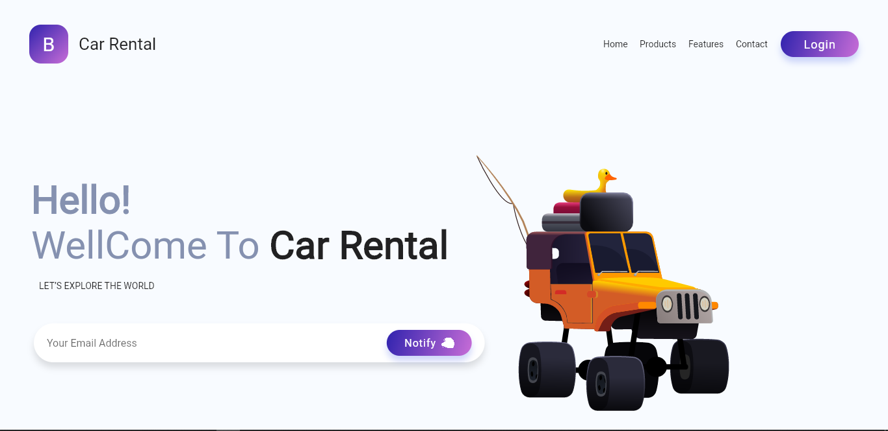

# Car Rental Web App

 
 

## Description

This project is a web application created using Flutter. The web app also make use of Rive animation assets and dependencies.

### Flutter

[Flutter](https://flutter.dev/) is Google’s UI toolkit for building beautiful, natively compiled applications for mobile, web, and desktop from a single codebase.

### Rive

[Rive](https://rive.app/) is a real-time interactive design tool that allows you to design, animate, and immediately integrate your assets into any platform thanks to our open source runtimes.
Rive has various implementation, but the one used in this project [Rive-Flutter](https://github.com/rive-app/rive-flutter)

## Front-End Design

**Landing Page**

